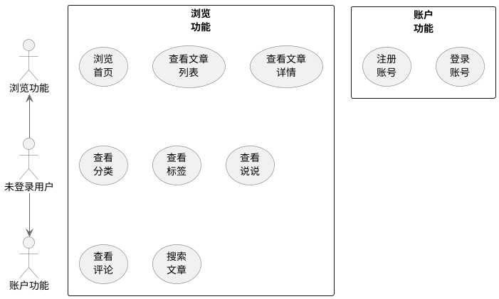
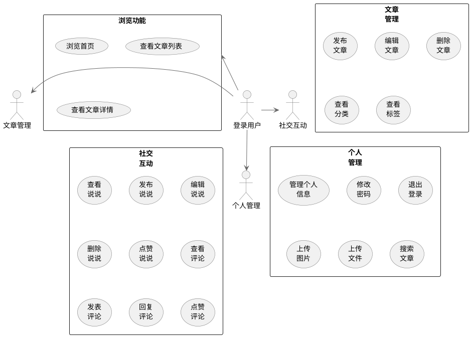
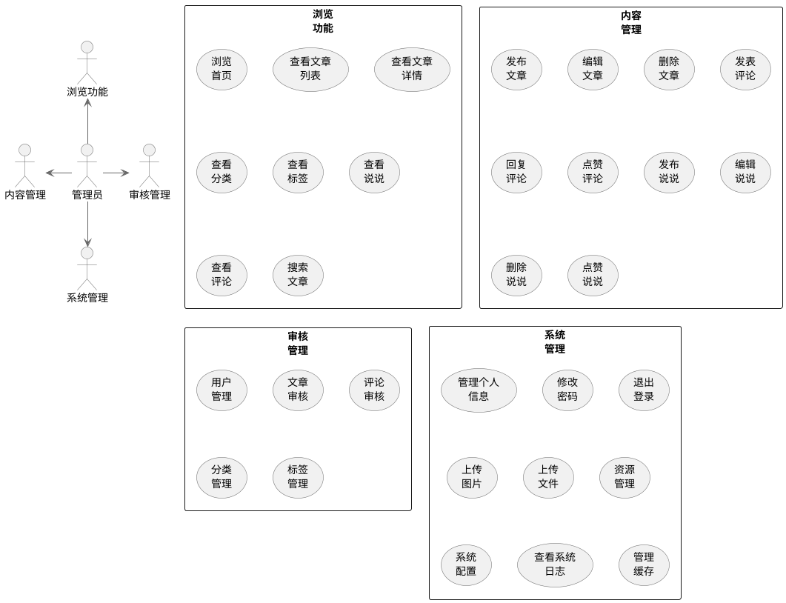

# 第2章 系统分析

## 2.1 可行性分析

### 2.1.1 技术可行性

系统采用前后端分离架构，后端使用SpringBoot框架构建RESTful API，前端使用Vue框架实现用户界面，数据库采用MySQL存储数据。这种技术栈是当前Web开发的主流选择，系统后端实现界面的展示和请求数据，后端为前端处理数据，明确的分工有利于系统的开发。后端用IDEA进行基于SpringBoot框架的项目搭建，配置、编码和部署相对来说比较简单，数据库持久层框架采用MyBatis-Plus，减轻了开发者的工作量，后期维护的难度也不会很大，采用Navicat将MySQL数据库进行可视化管理，并且Navicat提供了很多功能，利于开发。前端由Vue框架开发，在编写系统界面的时候能够实时看到布局效果，所见即所得，方便系统界面的开发，并且它拥有丰富的组件库，编写好代码之后可以直接在浏览器上进行测试，非常方便。开发环境对于计算机硬件的要求也不会很高，并且在碰到问题的时候可以通过互联网搜索，一般都能找到解决问题的方法。系统开发完成之后打包成Jar包，在云服务器上安装系统运行需要的环境，进行部署，从技术层面考虑系统开发具有可行性。

### 2.1.2 操作可行性

对于用户来说，登录之后就可以直接使用软件，界面简洁友好，操作简单，易于上手。在用户输入不合理的数据的时候系统会给出相应的提示引导用户去修改，人机交互性好。博客网站采用响应式设计，适配不同设备屏幕尺寸，用户可以在不同设备上流畅访问。管理后台界面布局合理，功能模块划分清晰，管理员可以方便地进行内容管理和系统配置。移动端小程序界面简洁，操作便捷，用户可以随时随地访问博客内容。系统对于各类用户的使用门槛都比较低，都能很快熟练使用，因此软件具有操作可行性。

### 2.1.3 经济可行性

系统的开发是为了提供一个个人博客平台，让用户能够分享知识和表达思想。系统开发采用的软件大多都是开源的，不需要购买商业软件，开发成本低。项目后期部署采用云服务器，产生的费用不会很高，适合个人或小型团队使用。系统采用模块化设计，代码结构清晰，后期维护成本低。个人博客系统可以作为个人品牌的展示平台，提高个人影响力，也可以通过广告、赞助等方式获得一定的收益。因此，从经济层面考虑，系统开发具有经济可行性。

## 2.2 系统需求分析

本课题是基于SpringBoot+Vue的个人博客系统的设计与实现，系统分为三个版本：博客网站、管理后台和移动端小程序，设计出以下核心模块：用户管理模块、文章管理模块、评论管理模块、分类标签管理模块、说说管理模块、资源管理模块和系统配置模块。

### 2.2.1 用户管理模块需求分析

#### 普通用户功能：
1. **注册账号**：用户可以通过邮箱或手机号注册账号，需要验证邮箱或手机号的有效性。
2. **登录账号**：用户可以通过账号密码登录，也可以通过第三方账号（如GitHub、Gitee）登录。
3. **退出账号**：用户可以退出当前登录状态，清除登录凭证。
4. **修改密码**：用户可以在登录状态下修改密码，需要验证旧密码。
5. **找回密码**：用户可以通过邮箱或手机号找回密码。
6. **个人信息管理**：用户可以查看和修改个人信息，如昵称、头像、简介等。

#### 管理员功能：
1. **登录账号**：管理员可以通过账号密码登录系统。
2. **退出账号**：管理员可以退出当前登录状态，清除登录凭证。
3. **修改密码**：管理员可以在登录状态下修改密码，需要验证旧密码。
4. **用户管理**：管理员可以查看、编辑、禁用用户账号。
5. **权限控制**：管理员可以设置用户角色和权限。

### 2.2.2 文章管理模块需求分析

#### 普通用户功能：
1. **发布文章**：用户可以发布文章，支持Markdown格式，可设置标题、内容、分类、标签等。
2. **编辑文章**：用户可以编辑自己已发布的文章，修改文章内容、分类、标签等。
3. **删除文章**：用户可以删除自己发布的文章。
4. **查看文章**：用户可以查看文章详情，支持Markdown渲染。
5. **文章列表**：用户可以浏览文章列表，支持分页、排序。
6. **文章搜索**：用户可以通过关键词搜索文章。

#### 管理员功能：
1. **审核文章**：管理员可以审核用户发布的文章。
2. **查看文章**：管理员可以查看所有文章详情。
3. **文章列表**：管理员可以浏览所有文章列表，支持分页、排序和筛选。
4. **文章搜索**：管理员可以通过关键词搜索文章。
5. **删除文章**：管理员可以删除任何文章。

### 2.2.3 评论管理模块需求分析

#### 普通用户功能：
1. **发表评论**：用户可以对文章发表评论，支持回复其他评论。
2. **删除评论**：用户可以删除自己发表的评论。
3. **评论列表**：用户可以查看文章的评论列表。
4. **评论点赞**：用户可以对评论进行点赞。

#### 管理员功能：
1. **审核评论**：管理员可以审核用户发表的评论。
2. **查看评论**：管理员可以查看所有评论。
3. **删除评论**：管理员可以删除任何评论。

### 2.2.4 分类标签管理模块需求分析

#### 普通用户功能：
1. **添加标签**：用户可以为自己的文章添加标签。
2. **标签列表**：用户可以查看系统标签列表。

#### 管理员功能：
1. **添加分类**：管理员可以添加文章分类，设置分类名称、描述等。
2. **编辑分类**：管理员可以编辑已有的分类信息。
3. **删除分类**：管理员可以删除不需要的分类。
4. **管理标签**：管理员可以管理系统标签，包括添加、编辑和删除标签。

### 2.2.5 说说管理模块需求分析

#### 普通用户功能：
1. **发布说说**：用户可以发布说说，分享心情和动态。
2. **编辑说说**：用户可以编辑自己已发布的说说。
3. **删除说说**：用户可以删除自己发布的说说。
4. **查看说说**：用户可以查看其他用户的说说。
5. **说说点赞**：用户可以对说说进行点赞。
6. **说说评论**：用户可以对说说进行评论。

#### 管理员功能：
1. **查看说说**：管理员可以查看所有用户的说说。
2. **删除说说**：管理员可以删除任何用户的说说。

### 2.2.6 资源管理模块需求分析

#### 普通用户功能：
1. **上传图片**：用户可以上传图片，支持批量上传。
2. **上传文件**：用户可以上传文件，如文档、视频等。
3. **管理资源**：用户可以查看、删除自己上传的资源。

#### 管理员功能：
1. **查看资源**：管理员可以查看系统所有资源。
2. **管理资源**：管理员可以管理所有用户上传的资源，包括查看和删除。

### 2.2.7 系统配置模块需求分析

#### 普通用户功能：
- 无访问权限

#### 管理员功能：
1. **网站设置**：管理员可以设置网站名称、Logo、描述、关键词等。
2. **导航菜单**：管理员可以配置网站导航菜单。
3. **权限设置**：管理员可以设置用户角色和权限。
4. **系统日志**：管理员可以查看系统操作日志。
5. **缓存管理**：管理员可以管理系统缓存。

## 2.3 用例图

### 2.3.1 未登录用户功能用例图

未登录用户功能用例图
（1）在博客网站中，未登录用户拥有浏览功能和账户功能。
（2）浏览功能包括：浏览首页、查看文章列表、查看文章详情、查看分类、查看标签、查看说说、查看评论、搜索文章。
（3）账户功能包括：登录账号、注册账号。
（4）在管理后台中，未登录用户只有登录账号功能。
未登录用户功能用例图如图2-1所示：

**未登录用户功能用例图：**

### 2.3.2 普通登录用户功能用例图

普通用户登录后，拥有浏览功能、文章管理、社交互动和个人管理四大功能模块。
（1）浏览功能包括：浏览首页、查看文章列表、查看文章详情。
（2）文章管理包括：发布文章、编辑文章、删除文章、查看分类、查看标签。
（3）社交互动包括：查看说说、发布说说、编辑说说、删除说说、点赞说说、查看评论、发表评论、回复评论、点赞评论。
（4）个人管理包括：管理个人信息、修改密码、退出登录、上传图片、上传文件、搜索文章。
普通登录用户功能用例图如图2-2所示：

**普通登录用户功能用例图：**

### 2.3.3 管理员功能用例图

管理员登录后，拥有浏览功能、内容管理、审核管理和系统管理四大功能模块。
（1）浏览功能包括：浏览首页、查看文章列表、查看文章详情、查看分类、查看标签、查看说说、查看评论、搜索文章。
（2）内容管理包括：发布文章、编辑文章、删除文章、发表评论、回复评论、点赞评论、发布说说、编辑说说、删除说说、点赞说说。
（3）审核管理包括：用户管理、文章审核、评论审核、分类管理、标签管理。
（4）系统管理包括：管理个人信息、修改密码、退出登录、上传图片、上传文件、资源管理、系统配置、查看系统日志、管理缓存。
管理员用例图如图2-3所示：

**管理员功能用例图：**

