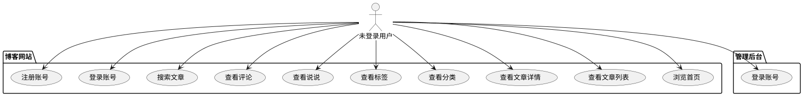

# 第2章 系统分析

## 2.1 可行性分析

### 2.1.1 技术可行性

系统采用前后端分离架构，后端使用SpringBoot框架构建RESTful API，前端使用Vue框架实现用户界面，数据库采用MySQL存储数据。这种技术栈是当前Web开发的主流选择，系统后端实现界面的展示和请求数据，后端为前端处理数据，明确的分工有利于系统的开发。后端用IDEA进行基于SpringBoot框架的项目搭建，配置、编码和部署相对来说比较简单，数据库持久层框架采用MyBatis-Plus，减轻了开发者的工作量，后期维护的难度也不会很大，采用Navicat将MySQL数据库进行可视化管理，并且Navicat提供了很多功能，利于开发。前端由Vue框架开发，在编写系统界面的时候能够实时看到布局效果，所见即所得，方便系统界面的开发，并且它拥有丰富的组件库，编写好代码之后可以直接在浏览器上进行测试，非常方便。开发环境对于计算机硬件的要求也不会很高，并且在碰到问题的时候可以通过互联网搜索，一般都能找到解决问题的方法。系统开发完成之后打包成Jar包，在云服务器上安装系统运行需要的环境，进行部署，从技术层面考虑系统开发具有可行性。

### 2.1.2 操作可行性

对于用户来说，登录之后就可以直接使用软件，界面简洁友好，操作简单，易于上手。在用户输入不合理的数据的时候系统会给出相应的提示引导用户去修改，人机交互性好。博客网站采用响应式设计，适配不同设备屏幕尺寸，用户可以在不同设备上流畅访问。管理后台界面布局合理，功能模块划分清晰，管理员可以方便地进行内容管理和系统配置。移动端小程序界面简洁，操作便捷，用户可以随时随地访问博客内容。系统对于各类用户的使用门槛都比较低，都能很快熟练使用，因此软件具有操作可行性。

### 2.1.3 经济可行性

系统的开发是为了提供一个个人博客平台，让用户能够分享知识和表达思想。系统开发采用的软件大多都是开源的，不需要购买商业软件，开发成本低。项目后期部署采用云服务器，产生的费用不会很高，适合个人或小型团队使用。系统采用模块化设计，代码结构清晰，后期维护成本低。个人博客系统可以作为个人品牌的展示平台，提高个人影响力，也可以通过广告、赞助等方式获得一定的收益。因此，从经济层面考虑，系统开发具有经济可行性。

## 2.2 系统需求分析

本课题是基于SpringBoot+Vue的个人博客系统的设计与实现，系统分为三个版本：博客网站、管理后台和移动端小程序，设计出以下核心模块：用户管理模块、文章管理模块、评论管理模块、分类标签管理模块、说说管理模块、资源管理模块和系统配置模块。

### 2.2.1 用户管理模块需求分析

用户管理模块主要包括以下功能：

1. **注册账号**：用户可以通过邮箱或手机号注册账号，需要验证邮箱或手机号的有效性。

2. **登录账号**：用户可以通过账号密码登录，也可以通过第三方账号（如GitHub、Gitee）登录。

3. **退出账号**：用户可以退出当前登录状态，清除登录凭证。

4. **修改密码**：用户可以在登录状态下修改密码，需要验证旧密码。

5. **找回密码**：用户可以通过邮箱或手机号找回密码。

6. **个人信息管理**：用户可以查看和修改个人信息，如昵称、头像、简介等。

7. **权限控制**：系统根据用户角色分配不同的权限，如普通用户、管理员等。

8. **用户管理**：管理员可以查看、编辑、禁用用户账号。

### 2.2.2 文章管理模块需求分析

文章管理模块主要包括以下功能：

1. **发布文章**：用户可以发布文章，支持Markdown格式，可设置标题、内容、分类、标签等。

2. **编辑文章**：用户可以编辑已发布的文章，修改文章内容、分类、标签等。

3. **删除文章**：用户可以删除自己发布的文章。

4. **查看文章**：用户可以查看文章详情，支持Markdown渲染。

5. **文章列表**：用户可以浏览文章列表，支持分页、排序。

6. **文章搜索**：用户可以通过关键词搜索文章。

7. **文章审核**：管理员可以审核用户发布的文章。

### 2.2.3 评论管理模块需求分析

评论管理模块主要包括以下功能：

1. **发表评论**：用户可以对文章发表评论，支持回复其他评论。

2. **删除评论**：用户可以删除自己发表的评论，管理员可以删除任何评论。

3. **评论列表**：用户可以查看文章的评论列表。

4. **评论审核**：管理员可以审核用户发表的评论。

5. **评论点赞**：用户可以对评论进行点赞。

### 2.2.4 分类标签管理模块需求分析

分类标签管理模块主要包括以下功能：

1. **添加分类**：管理员可以添加文章分类，设置分类名称、描述等。

2. **编辑分类**：管理员可以编辑已有的分类信息。

3. **删除分类**：管理员可以删除不需要的分类。

4. **添加标签**：用户可以为文章添加标签，管理员可以管理系统标签。

5. **标签列表**：用户可以查看系统标签列表。

### 2.2.5 说说管理模块需求分析

说说管理模块主要包括以下功能：

1. **发布说说**：用户可以发布说说，分享心情和动态。

2. **编辑说说**：用户可以编辑已发布的说说。

3. **删除说说**：用户可以删除自己发布的说说。

4. **查看说说**：用户可以查看其他用户的说说。

5. **说说点赞**：用户可以对说说进行点赞。

6. **说说评论**：用户可以对说说进行评论。

### 2.2.6 资源管理模块需求分析

资源管理模块主要包括以下功能：

1. **上传图片**：用户可以上传图片，支持批量上传。

2. **上传文件**：用户可以上传文件，如文档、视频等。

3. **管理资源**：用户可以查看、删除自己上传的资源。

4. **资源列表**：管理员可以查看系统所有资源。

### 2.2.7 系统配置模块需求分析

系统配置模块主要包括以下功能：

1. **网站设置**：管理员可以设置网站名称、Logo、描述、关键词等。

2. **导航菜单**：管理员可以配置网站导航菜单。

3. **权限设置**：管理员可以设置用户角色和权限。

4. **系统日志**：管理员可以查看系统操作日志。

5. **缓存管理**：管理员可以管理系统缓存。

## 2.3 用例图

### 2.3.1 未登录用户功能用例图

未登录用户功能用例图
（1）在博客网站中，未登录用户，可以浏览首页、查看文章列表、查看文章详情、查看分类、查看标签、查看说说、查看评论、搜索文章、登录账号和注册账号等功能。
（2）在管理后台中，未登录用户，只有登录账号功能。
未登录用户功能用例图如图2-1所示：

**未登录用户功能用例图：**

### 2.3.2 登录用户功能用例图

登录用户后，拥有账号模块、文章模块、评论模块、说说模块、资源模块和个人信息模块中一部分功能。
（1）账号模块，包含退出账号、修改密码和找回密码。
（2）个人信息模块，包含编辑个人信息和显示个人信息。
（3）文章模块，包含发布文章、编辑文章、删除文章、查看文章和搜索文章。
（4）评论模块，包含发表评论、回复评论、删除评论和点赞评论。
（5）说说模块，包含发布说说、编辑说说、删除说说和点赞说说。
（6）资源模块，包含上传图片和上传文件。
登录用户功能用例图如图2-2所示：

**登录用户功能用例图：**

```plantuml
@startuml
' 垂直布局
top to bottom direction

' 角色定义
actor "登录用户" as Actor2

' 账号模块
package "账号模块" {
  usecase "退出账号" as UC16
  usecase "修改密码" as UC17
  usecase "找回密码" as UC18
}

' 个人信息模块
package "个人信息模块" {
  usecase "编辑个人信息" as UC19
  usecase "显示个人信息" as UC20
}

' 文章模块
package "文章模块" {
  usecase "发布文章" as UC21
  usecase "编辑文章" as UC22
  usecase "删除文章" as UC23
  usecase "查看文章" as UC24
  usecase "搜索文章" as UC25
}

' 评论模块
package "评论模块" {
  usecase "发表评论" as UC26
  usecase "回复评论" as UC27
  usecase "删除评论" as UC28
  usecase "点赞评论" as UC29
}

' 说说模块
package "说说模块" {
  usecase "发布说说" as UC30
  usecase "编辑说说" as UC31
  usecase "删除说说" as UC32
  usecase "点赞说说" as UC33
}

' 资源模块
package "资源模块" {
  usecase "上传图片" as UC34
  usecase "上传文件" as UC35
}

' 关系定义
Actor2 --> UC16
Actor2 --> UC17
Actor2 --> UC18
Actor2 --> UC19
Actor2 --> UC20
Actor2 --> UC21
Actor2 --> UC22
Actor2 --> UC23
Actor2 --> UC24
Actor2 --> UC25
Actor2 --> UC26
Actor2 --> UC27
Actor2 --> UC28
Actor2 --> UC29
Actor2 --> UC30
Actor2 --> UC31
Actor2 --> UC32
Actor2 --> UC33
Actor2 --> UC34
Actor2 --> UC35

@enduml
```

### 2.3.3 管理员功能用例图

管理员登录后，拥有账号模块、用户管理模块、文章管理模块、评论管理模块、分类标签管理模块、资源管理模块和系统配置模块中一部分功能。
（1）账号模块，包含退出账号和修改密码。
（2）用户管理模块，包含查看用户、编辑用户、禁用用户和搜索用户。
（3）文章管理模块，包含审核文章、查看文章、搜索文章和删除文章。
（4）评论管理模块，包含审核评论、查看评论和删除评论。
（5）分类标签管理模块，包含添加分类、编辑分类、删除分类、添加标签和管理标签。
（6）资源管理模块，包含查看资源和管理资源。
（7）系统配置模块，包含网站设置、导航菜单配置、权限设置、查看系统日志和管理缓存。
管理员用例图如图2-3所示：

**管理员功能用例图：**

```plantuml
@startuml
' 垂直布局
top to bottom direction

' 角色定义
actor "管理员" as Actor3

' 账号模块
package "账号模块" {
  usecase "退出账号" as UC36
  usecase "修改密码" as UC37
}

' 用户管理模块
package "用户管理模块" {
  usecase "查看用户" as UC38
  usecase "编辑用户" as UC39
  usecase "禁用用户" as UC40
  usecase "搜索用户" as UC41
}

' 文章管理模块
package "文章管理模块" {
  usecase "审核文章" as UC42
  usecase "查看文章" as UC43
  usecase "搜索文章" as UC44
  usecase "删除文章" as UC45
}

' 评论管理模块
package "评论管理模块" {
  usecase "审核评论" as UC46
  usecase "查看评论" as UC47
  usecase "删除评论" as UC48
}

' 分类标签管理模块
package "分类标签管理模块" {
  usecase "添加分类" as UC49
  usecase "编辑分类" as UC50
  usecase "删除分类" as UC51
  usecase "添加标签" as UC52
  usecase "管理标签" as UC53
}

' 资源管理模块
package "资源管理模块" {
  usecase "查看资源" as UC54
  usecase "管理资源" as UC55
}

' 系统配置模块
package "系统配置模块" {
  usecase "网站设置" as UC56
  usecase "导航菜单配置" as UC57
  usecase "权限设置" as UC58
  usecase "查看系统日志" as UC59
  usecase "管理缓存" as UC60
}

' 关系定义
Actor3 --> UC36
Actor3 --> UC37
Actor3 --> UC38
Actor3 --> UC39
Actor3 --> UC40
Actor3 --> UC41
Actor3 --> UC42
Actor3 --> UC43
Actor3 --> UC44
Actor3 --> UC45
Actor3 --> UC46
Actor3 --> UC47
Actor3 --> UC48
Actor3 --> UC49
Actor3 --> UC50
Actor3 --> UC51
Actor3 --> UC52
Actor3 --> UC53
Actor3 --> UC54
Actor3 --> UC55
Actor3 --> UC56
Actor3 --> UC57
Actor3 --> UC58
Actor3 --> UC59
Actor3 --> UC60

@enduml
```

