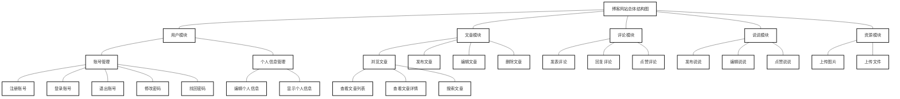

# 第3章 系统设计

## 3.1 系统总体设计

系统分两个版本，博客网站和管理后台。博客网站，是用户使用的，是一个基于Vue的单页应用网站；管理后台，是管理员使用，管理用户、文章、评论、分类标签等信息，也是一个后台管理系统。

博客网站，分为多个模块，分别为用户模块、文章模块、评论模块、说说模块和资源模块。用户模块有账号管理和个人信息管理。文章模块有浏览文章、发布文章、编辑文章和删除文章。评论模块有发表评论、回复评论和点赞评论。说说模块有发布说说、编辑说说和点赞说说。资源模块有上传图片和上传文件。其中，各个管理中又细分为更小的功能。博客网站总体结构图如图3-1所示。

**图3-1 博客网站总体结构图**



管理后台，分为多个模块，分别为用户管理模块、文章管理模块、评论管理模块、分类标签管理模块、资源管理模块和系统配置模块。用户管理模块有查看用户、编辑用户和禁用用户。文章管理模块有审核文章、查看文章和删除文章。评论管理模块有审核评论、查看评论和删除评论。分类标签管理模块有添加分类、编辑分类、删除分类和管理标签。资源管理模块有查看资源和管理资源。系统配置模块有网站设置、导航菜单配置、权限设置、查看系统日志和管理缓存。其中，各个管理中又细分为更小的功能。管理后台总体结构图如图3-2所示。

**图3-2 管理后台总体结构图**

```mermaid
graph TB
    classDef rectStyle fill:none,stroke:black,stroke-width:2px,shape:rectangle
    
    管理后台[管理后台总体结构图]
    
    管理后台 --- 用户管理模块[用户管理模块]
    管理后台 --- 文章管理模块[文章管理模块]
    管理后台 --- 评论管理模块[评论管理模块]
    管理后台 --- 分类标签管理模块[分类标签管理模块]
    管理后台 --- 资源管理模块[资源管理模块]
    管理后台 --- 系统配置模块[系统配置模块]
    
    用户管理模块 --- 查看用户[查看用户]
    用户管理模块 --- 编辑用户[编辑用户]
    用户管理模块 --- 禁用用户[禁用用户]
    用户管理模块 --- 搜索用户[搜索用户]
    
    文章管理模块 --- 审核文章[审核文章]
    文章管理模块 --- 查看文章[查看文章]
    文章管理模块 --- 删除文章[删除文章]
    文章管理模块 --- 搜索文章[搜索文章]
    
    评论管理模块 --- 审核评论[审核评论]
    评论管理模块 --- 查看评论[查看评论]
    评论管理模块 --- 删除评论[删除评论]
    
    分类标签管理模块 --- 添加分类[添加分类]
    分类标签管理模块 --- 编辑分类[编辑分类]
    分类标签管理模块 --- 删除分类[删除分类]
    分类标签管理模块 --- 管理标签[管理标签]
    
    资源管理模块 --- 查看资源[查看资源]
    资源管理模块 --- 管理资源[管理资源]
    
    系统配置模块 --- 网站设置[网站设置]
    系统配置模块 --- 导航菜单配置[导航菜单配置]
    系统配置模块 --- 权限设置[权限设置]
    系统配置模块 --- 查看系统日志[查看系统日志]
    系统配置模块 --- 管理缓存[管理缓存]
    
    class 管理后台,用户管理模块,文章管理模块,评论管理模块,分类标签管理模块,资源管理模块,系统配置模块,查看用户,编辑用户,禁用用户,搜索用户,审核文章,查看文章,删除文章,搜索文章,审核评论,查看评论,删除评论,添加分类,编辑分类,删除分类,管理标签,查看资源,管理资源,网站设置,导航菜单配置,权限设置,查看系统日志,管理缓存 rectStyle
```



## 3.2 公共功能设计

### 3.2.1 用户注册

**功能描述**：用户可以通过邮箱或手机号注册账号，需要验证邮箱或手机号的有效性。

**流程设计**：
1. 用户访问注册页面，输入邮箱/手机号、密码、确认密码等信息
2. 系统验证输入信息的合法性
3. 系统发送验证码到用户邮箱/手机
4. 用户输入验证码进行验证
5. 验证通过后，系统创建用户账号并返回注册成功信息

**接口设计**：
- 接口路径：`/api/auth/register`
- 请求方式：POST
- 请求参数：
  - email：邮箱地址
  - password：密码
  - confirmPassword：确认密码
  - code：验证码
- 响应结果：注册成功/失败信息

### 3.2.2 用户登录

**功能描述**：用户可以通过账号密码登录系统，支持普通用户和管理员登录。

**流程设计**：
1. 用户访问登录页面，输入邮箱/手机号和密码
2. 系统验证用户凭证
3. 验证通过后，系统生成token并返回给前端
4. 前端存储token，用于后续请求的身份验证

**接口设计**：
- 接口路径：`/api/auth/login`
- 请求方式：POST
- 请求参数：
  - email：邮箱地址
  - password：密码
- 响应结果：token和用户信息

### 3.2.3 找回密码

**功能描述**：用户可以通过邮箱或手机号找回密码。

**流程设计**：
1. 用户访问找回密码页面，输入邮箱/手机号
2. 系统发送验证码到用户邮箱/手机
3. 用户输入验证码进行验证
4. 验证通过后，用户设置新密码
5. 系统更新用户密码并返回成功信息

**接口设计**：
- 接口路径：`/api/auth/resetPassword`
- 请求方式：POST
- 请求参数：
  - email：邮箱地址
  - code：验证码
  - newPassword：新密码
- 响应结果：密码重置成功/失败信息

## 3.3 用户功能设计

### 3.3.1 浏览文章

**功能描述**：用户可以浏览文章列表、查看文章详情。

**流程设计**：
1. 用户访问博客首页，系统显示文章列表
2. 用户点击文章标题，系统显示文章详情
3. 系统记录文章浏览量

**接口设计**：
- 文章列表接口：`/api/article/list`
  - 请求方式：GET
  - 请求参数：
    - page：页码
    - size：每页数量
    - categoryId：分类ID（可选）
    - tagId：标签ID（可选）
  - 响应结果：文章列表数据

- 文章详情接口：`/api/article/detail/{id}`
  - 请求方式：GET
  - 响应结果：文章详情数据

### 3.3.2 发布文章

**功能描述**：登录用户可以发布文章，支持Markdown格式。

**流程设计**：
1. 用户进入文章编辑页面
2. 输入文章标题、内容、分类、标签等信息
3. 点击发布按钮，系统保存文章并返回成功信息

**接口设计**：
- 接口路径：`/api/article/add`
- 请求方式：POST
- 请求参数：
  - title：文章标题
  - content：文章内容
  - categoryId：分类ID
  - tagIds：标签ID列表
  - status：发布状态
- 响应结果：文章发布成功/失败信息

### 3.3.3 编辑文章

**功能描述**：登录用户可以编辑自己已发布的文章。

**流程设计**：
1. 用户进入文章编辑页面，系统加载文章现有内容
2. 修改文章信息
3. 点击保存按钮，系统更新文章并返回成功信息

**接口设计**：
- 接口路径：`/api/article/update`
- 请求方式：PUT
- 请求参数：
  - id：文章ID
  - title：文章标题
  - content：文章内容
  - categoryId：分类ID
  - tagIds：标签ID列表
  - status：发布状态
- 响应结果：文章更新成功/失败信息

### 3.3.4 删除文章

**功能描述**：登录用户可以删除自己发布的文章。

**流程设计**：
1. 用户在文章列表或详情页面点击删除按钮
2. 系统弹出确认对话框
3. 用户确认删除，系统删除文章并返回成功信息

**接口设计**：
- 接口路径：`/api/article/delete`
- 请求方式：DELETE
- 请求参数：
  - ids：文章ID列表
- 响应结果：文章删除成功/失败信息

### 3.3.5 发表评论

**功能描述**：登录用户可以对文章发表评论，支持回复其他评论。

**流程设计**：
1. 用户在文章详情页面输入评论内容
2. 点击提交按钮，系统保存评论并返回成功信息
3. 页面实时更新评论列表

**接口设计**：
- 接口路径：`/api/comment/add`
- 请求方式：POST
- 请求参数：
  - articleId：文章ID
  - content：评论内容
  - parentId：父评论ID（回复时使用）
- 响应结果：评论发表成功/失败信息

### 3.3.6 发布说说

**功能描述**：登录用户可以发布说说，分享心情和动态。

**流程设计**：
1. 用户进入说说发布页面
2. 输入说说内容，可选择添加图片
3. 点击发布按钮，系统保存说说并返回成功信息

**接口设计**：
- 接口路径：`/api/moment/add`
- 请求方式：POST
- 请求参数：
  - content：说说内容
  - images：图片URL列表
- 响应结果：说说发布成功/失败信息

### 3.3.7 个人信息管理

**功能描述**：登录用户可以查看和修改个人信息，如昵称、头像、简介等。

**流程设计**：
1. 用户进入个人中心页面
2. 查看个人信息
3. 点击编辑按钮，修改个人信息
4. 点击保存按钮，系统更新个人信息并返回成功信息

**接口设计**：
- 获取个人信息接口：`/api/user/profile`
  - 请求方式：GET
  - 响应结果：用户个人信息

- 更新个人信息接口：`/api/user/updateProfile`
  - 请求方式：PUT
  - 请求参数：
    - nickname：昵称
    - avatar：头像URL
    - bio：个人简介
  - 响应结果：个人信息更新成功/失败信息

### 3.3.8 资源上传

**功能描述**：登录用户可以上传图片和文件，用于文章和说说。

**流程设计**：
1. 用户在编辑文章或发布说说时点击上传按钮
2. 选择要上传的文件
3. 系统上传文件并返回文件URL
4. 前端将文件URL插入到内容中

**接口设计**：
- 接口路径：`/api/file/upload`
- 请求方式：POST
- 请求参数：
  - file：文件
- 响应结果：文件上传成功/失败信息和文件URL

## 3.4 管理员功能设计

### 3.4.1 用户管理

**功能描述**：管理员可以查看、编辑、禁用用户账号。

**流程设计**：
1. 管理员进入用户管理页面
2. 查看用户列表，支持分页和搜索
3. 点击编辑按钮，修改用户信息
4. 点击禁用/启用按钮，修改用户状态

**接口设计**：
- 用户列表接口：`/api/admin/user/list`
  - 请求方式：GET
  - 请求参数：
    - page：页码
    - size：每页数量
    - keyword：搜索关键词
  - 响应结果：用户列表数据

- 更新用户接口：`/api/admin/user/update`
  - 请求方式：PUT
  - 请求参数：
    - id：用户ID
    - nickname：昵称
    - email：邮箱
    - status：状态
  - 响应结果：用户更新成功/失败信息

### 3.4.2 文章管理

**功能描述**：管理员可以审核、查看、搜索和删除文章。

**流程设计**：
1. 管理员进入文章管理页面
2. 查看文章列表，支持分页、搜索和筛选
3. 点击审核按钮，修改文章状态
4. 点击删除按钮，删除文章

**接口设计**：
- 文章列表接口：`/api/admin/article/list`
  - 请求方式：GET
  - 请求参数：
    - page：页码
    - size：每页数量
    - keyword：搜索关键词
    - status：状态
  - 响应结果：文章列表数据

- 审核文章接口：`/api/admin/article/audit`
  - 请求方式：PUT
  - 请求参数：
    - id：文章ID
    - status：状态
  - 响应结果：文章审核成功/失败信息

### 3.4.3 评论管理

**功能描述**：管理员可以审核、查看和删除评论。

**流程设计**：
1. 管理员进入评论管理页面
2. 查看评论列表，支持分页和搜索
3. 点击审核按钮，修改评论状态
4. 点击删除按钮，删除评论

**接口设计**：
- 评论列表接口：`/api/admin/comment/list`
  - 请求方式：GET
  - 请求参数：
    - page：页码
    - size：每页数量
    - keyword：搜索关键词
    - status：状态
  - 响应结果：评论列表数据

- 审核评论接口：`/api/admin/comment/audit`
  - 请求方式：PUT
  - 请求参数：
    - id：评论ID
    - status：状态
  - 响应结果：评论审核成功/失败信息

### 3.4.4 分类标签管理

**功能描述**：管理员可以添加、编辑、删除分类和标签。

**流程设计**：
1. 管理员进入分类管理页面
2. 点击添加按钮，创建新分类
3. 点击编辑按钮，修改分类信息
4. 点击删除按钮，删除分类
5. 标签管理流程类似

**接口设计**：
- 分类列表接口：`/api/admin/category/list`
  - 请求方式：GET
  - 响应结果：分类列表数据

- 添加分类接口：`/api/admin/category/add`
  - 请求方式：POST
  - 请求参数：
    - name：分类名称
    - description：分类描述
  - 响应结果：分类添加成功/失败信息

- 标签管理接口类似

### 3.4.5 资源管理

**功能描述**：管理员可以查看和管理系统所有资源。

**流程设计**：
1. 管理员进入资源管理页面
2. 查看资源列表，支持分页和搜索
3. 点击删除按钮，删除资源

**接口设计**：
- 资源列表接口：`/api/admin/resource/list`
  - 请求方式：GET
  - 请求参数：
    - page：页码
    - size：每页数量
    - keyword：搜索关键词
  - 响应结果：资源列表数据

- 删除资源接口：`/api/admin/resource/delete`
  - 请求方式：DELETE
  - 请求参数：
    - ids：资源ID列表
  - 响应结果：资源删除成功/失败信息

### 3.4.6 系统配置

**功能描述**：管理员可以设置网站名称、Logo、描述、关键词等系统配置。

**流程设计**：
1. 管理员进入系统配置页面
2. 修改配置信息
3. 点击保存按钮，系统更新配置并返回成功信息

**接口设计**：
- 获取系统配置接口：`/api/admin/config/get`
  - 请求方式：GET
  - 响应结果：系统配置信息

- 更新系统配置接口：`/api/admin/config/update`
  - 请求方式：PUT
  - 请求参数：
    - siteName：网站名称
    - siteLogo：网站Logo
    - siteDescription：网站描述
    - siteKeywords：网站关键词
  - 响应结果：系统配置更新成功/失败信息

## 3.5 数据库设计

### 3.5.1 数据库E-R图

```mermaid
erDiagram
    USER ||--o{ ARTICLE : publishes
    USER ||--o{ COMMENT : writes
    USER ||--o{ MOMENT : posts
    USER ||--o{ RESOURCE : uploads
    ARTICLE ||--o{ COMMENT : receives
    ARTICLE ||--o{ TAG : has
    ARTICLE ||--|{ CATEGORY : belongs to
    MOMENT ||--o{ COMMENT : receives

    USER {
        int id
        string username
        string email
        string password
        string nickname
        string avatar
        string bio
        int status
        datetime createTime
        datetime updateTime
    }

    ARTICLE {
        int id
        string title
        string content
        int categoryId
        string cover
        int viewCount
        int status
        int userId
        datetime createTime
        datetime updateTime
    }

    COMMENT {
        int id
        string content
        int articleId
        int userId
        int parentId
        int status
        datetime createTime
    }

    MOMENT {
        int id
        string content
        string images
        int userId
        datetime createTime
    }

    RESOURCE {
        int id
        string name
        string url
        string type
        int size
        int userId
        datetime createTime
    }

    CATEGORY {
        int id
        string name
        string description
        datetime createTime
    }

    TAG {
        int id
        string name
        datetime createTime
    }

    ARTICLE_TAG {
        int articleId
        int tagId
    }
```

### 3.5.2 数据表

#### 3.5.2.1 用户表（sys_user）
| 字段名 | 数据类型 | 长度 | 约束 | 描述 |
| :--- | :--- | :--- | :--- | :--- |
| id | int | 11 | PRIMARY KEY, AUTO_INCREMENT | 用户ID |
| username | varchar | 50 | NOT NULL, UNIQUE | 用户名 |
| email | varchar | 100 | NOT NULL, UNIQUE | 邮箱 |
| password | varchar | 100 | NOT NULL | 密码 |
| nickname | varchar | 50 | NOT NULL | 昵称 |
| avatar | varchar | 255 | | 头像 |
| bio | text | | | 个人简介 |
| status | tinyint | 1 | NOT NULL, DEFAULT 1 | 状态（1:正常, 0:禁用） |
| create_time | datetime | | NOT NULL | 创建时间 |
| update_time | datetime | | NOT NULL | 更新时间 |

#### 3.5.2.2 文章表（sys_article）
| 字段名 | 数据类型 | 长度 | 约束 | 描述 |
| :--- | :--- | :--- | :--- | :--- |
| id | int | 11 | PRIMARY KEY, AUTO_INCREMENT | 文章ID |
| title | varchar | 200 | NOT NULL | 标题 |
| content | longtext | | NOT NULL | 内容 |
| category_id | int | 11 | NOT NULL | 分类ID |
| cover | varchar | 255 | | 封面图片 |
| view_count | int | 11 | NOT NULL, DEFAULT 0 | 浏览量 |
| status | tinyint | 1 | NOT NULL, DEFAULT 1 | 状态（1:发布, 0:草稿, 2:待审核） |
| user_id | int | 11 | NOT NULL | 作者ID |
| create_time | datetime | | NOT NULL | 创建时间 |
| update_time | datetime | | NOT NULL | 更新时间 |

#### 3.5.2.3 评论表（sys_comment）
| 字段名 | 数据类型 | 长度 | 约束 | 描述 |
| :--- | :--- | :--- | :--- | :--- |
| id | int | 11 | PRIMARY KEY, AUTO_INCREMENT | 评论ID |
| content | text | | NOT NULL | 评论内容 |
| article_id | int | 11 | NOT NULL | 文章ID |
| user_id | int | 11 | NOT NULL | 用户ID |
| parent_id | int | 11 | | 父评论ID |
| status | tinyint | 1 | NOT NULL, DEFAULT 1 | 状态（1:正常, 0:禁用） |
| create_time | datetime | | NOT NULL | 创建时间 |

#### 3.5.2.4 说说表（sys_moment）
| 字段名 | 数据类型 | 长度 | 约束 | 描述 |
| :--- | :--- | :--- | :--- | :--- |
| id | int | 11 | PRIMARY KEY, AUTO_INCREMENT | 说说ID |
| content | text | | NOT NULL | 说说内容 |
| images | varchar | 1000 | | 图片URL，多个用逗号分隔 |
| user_id | int | 11 | NOT NULL | 用户ID |
| create_time | datetime | | NOT NULL | 创建时间 |

#### 3.5.2.5 资源表（sys_resource）
| 字段名 | 数据类型 | 长度 | 约束 | 描述 |
| :--- | :--- | :--- | :--- | :--- |
| id | int | 11 | PRIMARY KEY, AUTO_INCREMENT | 资源ID |
| name | varchar | 255 | NOT NULL | 资源名称 |
| url | varchar | 255 | NOT NULL | 资源URL |
| type | varchar | 50 | NOT NULL | 资源类型 |
| size | int | 11 | NOT NULL | 资源大小（字节） |
| user_id | int | 11 | NOT NULL | 上传用户ID |
| create_time | datetime | | NOT NULL | 创建时间 |

#### 3.5.2.6 分类表（sys_category）
| 字段名 | 数据类型 | 长度 | 约束 | 描述 |
| :--- | :--- | :--- | :--- | :--- |
| id | int | 11 | PRIMARY KEY, AUTO_INCREMENT | 分类ID |
| name | varchar | 50 | NOT NULL, UNIQUE | 分类名称 |
| description | text | | | 分类描述 |
| create_time | datetime | | NOT NULL | 创建时间 |

#### 3.5.2.7 标签表（sys_tag）
| 字段名 | 数据类型 | 长度 | 约束 | 描述 |
| :--- | :--- | :--- | :--- | :--- |
| id | int | 11 | PRIMARY KEY, AUTO_INCREMENT | 标签ID |
| name | varchar | 50 | NOT NULL, UNIQUE | 标签名称 |
| create_time | datetime | | NOT NULL | 创建时间 |

#### 3.5.2.8 文章标签关联表（sys_article_tag）
| 字段名 | 数据类型 | 长度 | 约束 | 描述 |
| :--- | :--- | :--- | :--- | :--- |
| article_id | int | 11 | PRIMARY KEY | 文章ID |
| tag_id | int | 11 | PRIMARY KEY | 标签ID |
